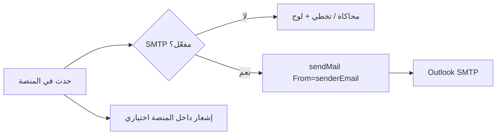

# تقرير دورة حياة البريد الإلكتروني — منصة تمكين

**الحالة الحالية (بعد النشر):** SMTP Outlook مفعّل على Coolify، واختبار الإرسال من إعدادات النظام **نجح**.  
**المرسل (From):** `senderEmail` من إعدادات النظام (يجب = `SMTP_USER`).  
**النقل:** `lib/mail.ts` → nodemailer → `smtp.office365.com:587` (STARTTLS).  
**عند فشل البريد في المسارات الأساسية:** `safeSendEmail` يسجّل التحذير ولا يوقف العملية (ما عدا OTP التسجيل واستعادة كلمة المرور حيث الإرسال جزء من التدفق).

---

## 1) البنية التحتية

| المكوّن | الدور |
|---------|--------|
| Coolify env `SMTP_*` | مصادقة النقل فقط |
| `senderEmail` (إعدادات المدير) | عنوان From لكل الرسائل |
| `NEXT_PUBLIC_APP_URL` | روابط إعادة التعيين وروابط لوحة المتابعة |
| `CRON_SECRET` | حماية `/api/cron/follow-up-reminders` |
| إشعار داخل المنصة | `createNotification` / `notifyAdmins` — مستقل عن SMTP وغالباً يرافق البريد |



---

## 2) جدول كل رسائل البريد (حسب دورة الحياة)

### أ) المصادقة والتسجيل (ضيف / مستفيد)

| # | الحدث | المحفّز | المستلم | الموضوع / المحتوى | مسار الكود |
|---|--------|---------|---------|-------------------|------------|
| 1 | رمز OTP للتسجيل | `/register` → POST register | المتقدّم (بريد جديد) | «رمز التحقق — تسجيل منصة تمكين» — رمز 6 أرقام / 10 دقائق | `register-verification` → `sendRegistrationOtpEmail` |
| 2 | إشعار مدير بتسجيل جديد | بعد إنشاء حساب المستفيد (بعد verify) | كل المستخدمين بدور ADMIN | «تسجيل مستفيد جديد — منصة تمكين» | `platform-service` بعد إنشاء المستخدم |
| 3 | استعادة كلمة المرور | `/forgot-password` | المستخدم إن وُجد البريد | «إعادة تعيين كلمة المرور» + رابط 30 دقيقة | `forgot-password` → `sendPasswordResetEmail` |
| 4 | بريد تجريبي | المدير → إعدادات → إرسال تجربة | البريد المدخل يدوياً | «رسالة تجريبية — منصة تمكين» | `/api/system-settings/test-email` |

**ملاحظات أ):**  
- بدون SMTP في الإنتاج: OTP يفشل برسالة واضحة. محلياً قد يظهر `previewCode`.  
- نسيت كلمة المرور: الرد دائماً عاماً (لا يكشف إن كان البريد موجوداً).  
- تعيين كلمة المرور عبر `/reset-password` **لا يرسل** بريداً إضافياً.

### ب) اعتماد المسار والمراحل (مدير → مستفيد)

| # | الحدث | المحفّز | المستلم | الموضوع | إشعار داخلي |
|---|--------|---------|---------|---------|-------------|
| 5 | اعتماد التسجيل | المدير يعتمد بعد إسناد مرشد | المستفيد | «تم اعتماد تسجيلك في منصة تمكين» | نعم |
| 6 | اعتماد انتقال مرحلة | المدير يعتمد `pendingStage` | المستفيد | «انتقال إلى مرحلة …» | نعم |
| — | إسناد مرشد فقط | assign guide | — | **لا بريد** | لا |

### ج) الجلسات (مرشد → مستفيد + مرشد)

| # | الحدث | المحفّز | المستلم | المحتوى |
|---|--------|---------|---------|---------|
| 7 | جدولة جلسة | المرشد ينشئ جلسة | **المستفيد + المرشد** | «تم جدولة جلسة إرشاد جديدة» + التاريخ + رابط/موقع |

تعديل/إكمال الجلسة: إشعار داخلي محتمل — **لا دورة بريد منفصلة موثّقة لنفس القالب** في المسار الحالي للإنشاء فقط.

### د) الفرص والتقديمات (مدير → مستفيد)

| # | الحدث | المحفّز | المستلم | المحتوى |
|---|--------|---------|---------|---------|
| 8 | قبول تقديم | مراجعة تقديم ACCEPTED | المستفيد | قبول + «سيتم إشعارك بالتفاصيل قريباً…» |
| 9 | رفض تقديم | مراجعة تقديم REJECTED | المستفيد | رفض + ملاحظة اختيارية |

تقديم المستفيد على فرصة: إشعار داخلي للإدارة إن وُجد — **بريد القبول/الرفض هو دورة البريد للمستفيد**.

### هـ) متابعة ما بعد التوظيف (مدير / Cron → مستفيد)

| # | الحدث | المحفّز | المستلم | المحتوى |
|---|--------|---------|---------|---------|
| 10 | بدء برنامج المتابعة | انتقال انتقال لمرحلة FOLLOW_UP | المستفيد | تذكير نموذج الشهر 1 + رابط اللوحة |
| 11 | تذكير شهري تلقائي | Cron `GET /api/cron/follow-up-reminders` | مستفيدون ACTIVE لم يكملوا الشهر | تذكير الشهر الحالي (حد أدنى 24س بين تذكيرين) |
| 12 | تذكير يدوي | المدير من تبويب المتابعة | المستفيد | نفس قالب التذكير للشهر النشط |
| 13 | اكتمال البرنامج | إكمال الأشهر / إغلاق مكتمل | المستفيد | «اكتمال برنامج المتابعة» |

فات موعد (`MISSED`): إشعار للمديرين داخل المنصة — **بدون بريد للمستفيد في هذا الفرع**.

---

## 3) دورات حياة متسلسلة (سيناريوهات)

### 3.1 مستفيد جديد → اعتماد → جلسة

```text
تسجيل (/register)
  → بريد OTP للمستفيد ①
  → verify → إنشاء الحساب
  → بريد لكل Admin ② + إشعار داخلي للمديرين
  → (مدير) إسناد مرشد — بلا بريد
  → (مدير) اعتماد التسجيل → بريد للمستفيد ⑤ + إشعار
  → (مرشد) جدولة جلسة → بريد للمستفيد والمرشد ⑦ + إشعار للمستفيد
```

### 3.2 نسيت كلمة المرور (أي دور لديه حساب)

```text
/forgot-password
  → إن وُجد المستخدم: بريد رابط /reset-password?token=… ③
  → المستخدم يعيّن كلمة جديدة — بلا بريد تأكيد
```

### 3.3 فرصة تدريب/توظيف

```text
مستفيد يقدّم → (عادة إشعار داخلي)
مدير يقبل/يرفض → بريد للمستفيد ⑧/⑨ + إشعار
  → إن قبول تدريب ومرحلة GUIDANCE: pendingStage=TRAINING + إشعار داخلي فقط
مدير يعتمد انتقال المرحلة → بريد للمستفيد ⑥
```

### 3.4 ما بعد التوظيف

```text
اعتماد انتقال FOLLOW_UP
  → initializeFollowUpProgram → بريد شهر 1 ⑩
Cron يومي / تذكير يدوي → بريد أشهر 1–6 حسب النافذة ⑪/⑫
اكتمال البرنامج → بريد تهنئة ⑬
```

---

## 4) ما لا يُرسل بريداً حالياً (مهم للتجربة)

- إسناد/تغيير المرشد فقط  
- إنشاء مهمة / تقييم مرشد / ملاحظات  
- تعديل ملف المستفيد من المرشد أو المدير  
- حذف مستفيد  
- تذكير المدير ببريد عند فات موعد متابعة (إشعار داخلي فقط)  
- بريد ترحيب للمرشد عند إنشائه من لوحة المدير  

---

## 5) مصفوفة الأدوار × البريد

| الدور | يستقبل بريداً عندما… | يطلق إرسال بريد عندما… |
|-------|---------------------|-------------------------|
| ضيف / متقدّم | OTP تسجيل؛ استعادة كلمة المرور | — |
| مستفيد | اعتماد؛ مرحلة؛ جلسة؛ قبول/رفض تقديم؛ تذكيرات متابعة؛ اكتمال متابعة؛ استعادة كلمة المرور | تقديم فرصة (لا بريد إلزامي منه) |
| مرشد | جدولة جلسة (نسخة له)؛ استعادة كلمة المرور | إنشاء جلسة → بريد للطرفين |
| مدير | تسجيل مستفيد جديد؛ استعادة كلمة المرور؛ بريد تجريبي | اعتماد تسجيل/مرحلة؛ مراجعة تقديم؛ تذكير متابعة يدوي؛ إعدادات SMTP |

---

## 6) قائمة تحقق ما بعد نجاح الإرسال التجريبي

1. OTP تسجيل حقيقي (بدون الاعتماد على previewCode)  
2. نسيت كلمة المرور → وصول الرابط وفتحه  
3. اعتماد مستفيد → بريد للمستفيد  
4. جدولة جلسة → بريد للمستفيد والمرشد  
5. قبول تقديم → بريد يتضمن «التفاصيل قريباً»  
6. تذكير متابعة يدوي أو Cron  
7. التأكد أن `CRON_SECRET` مجدول في Coolify إن لزم التذكير التلقائي  

مرجع البنود في الواجهة: `/uat-checklist` (المتبقي بعد النشر).
